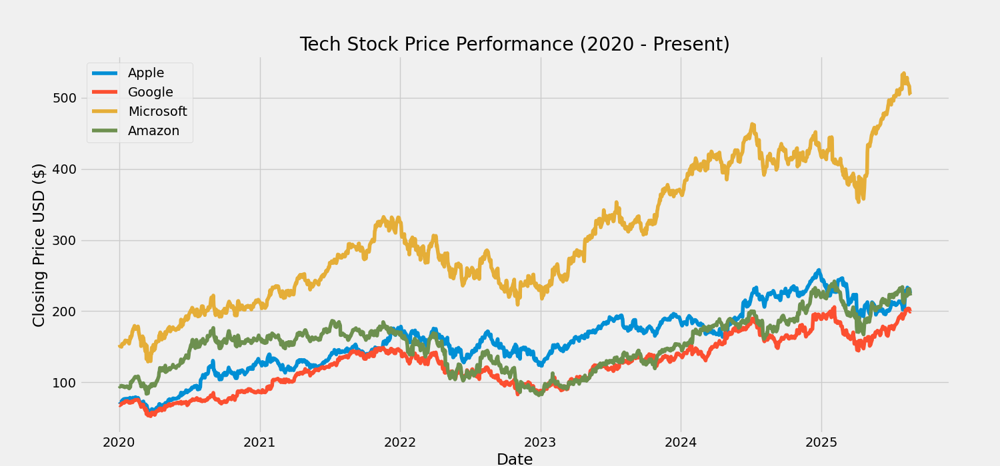
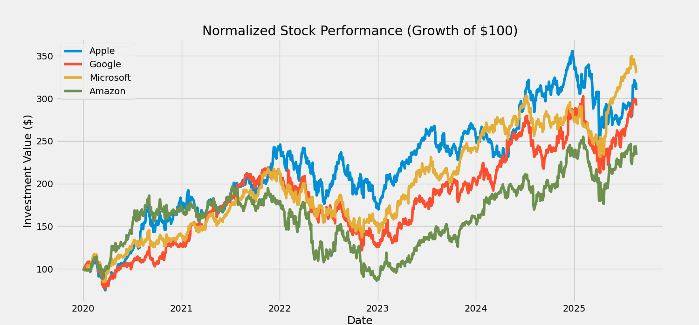
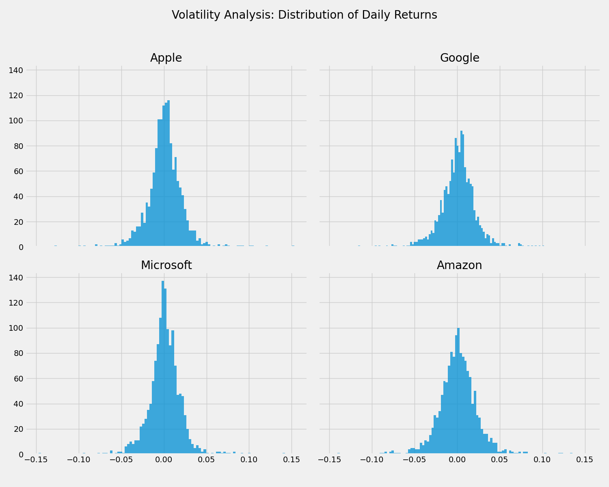

# Tech Stock Financial Dashboard

## Project Overview

This project is a comprehensive analysis of the stock performance of four major technology companies: Apple (AAPL), Google (GOOGL), Microsoft (MSFT), and Amazon (AMZN). The goal was to create a dashboard of visualizations to compare the companies across key financial metrics: absolute price performance, normalized growth, and risk (volatility). The entire analysis was conducted in a Jupyter Notebook using Python and its core data science libraries.

## Key Analyses & Visualizations

### 1. Absolute Price Performance
This chart shows the daily closing price of each stock over the last five years. It provides a clear view of which company has achieved the highest stock price.

### 2. Normalized Growth (The "Growth of $100" Chart)
This chart provides a more honest comparison of performance by showing the growth of a hypothetical $100 investment in each company from the start of the period. This reveals the true percentage growth champion.

### 3. Risk Profile (Volatility Analysis)
These histograms show the distribution of daily returns for each stock. A taller, narrower distribution indicates lower volatility and risk, while a wider distribution indicates a riskier, more volatile stock.

## Technologies Used

-   **Python**
-   **yfinance:** For downloading real-time, publicly available stock market data.
-   **Pandas:** For data manipulation, cleaning, and calculations.
-   **Matplotlib:** For creating all professional-grade visualizations.
-   **Jupyter Notebook:** For creating the interactive, end-to-end analysis report.

---
*This is a self-directed project designed to showcase skills in financial data analysis and visualization.*
